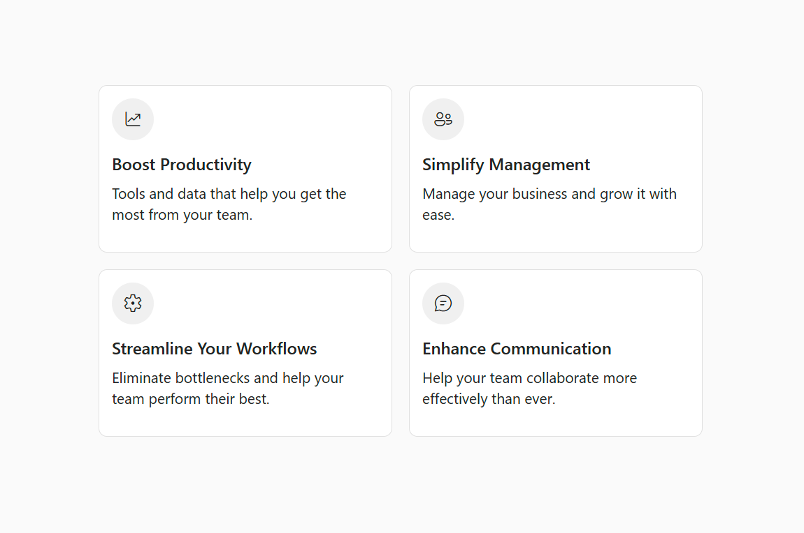

<!-- default badges list -->

<!-- default badges end -->
# DevExtreme TileView - Getting Started

This repository stores code for the following DevExpress tutorial: [Getting Started with DevExtreme TileView](https://js.devexpress.com/Documentation/Guide/UI_Components/TileView/Getting_Started_with_TileView/). The project creates a TileView and configures the component's core settings.

## Files to Review

- **jQuery**
    - [index.js](jQuery/src/index.js)
- **Angular**
    - [app.component.html](Angular/src/app/app.component.html)
    - [app.component.ts](Angular/src/app/app.component.ts)
- **Vue**
    - [Home.vue](Vue/src/components/HomeContent.vue)
- **React**
    - [App.tsx](React/src/App.tsx)
- **NetCore**    
    - [Index.cshtml](ASP.NET%20Core/Views/Home/Index.cshtml)

## Documentation

- [Getting Started with TileView](https://js.devexpress.com/Documentation/Guide/UI_Components/TileView/Getting_Started_with_TileView/)

- [TileView - API Reference](https://js.devexpress.com/Documentation/ApiReference/UI_Components/dxTileView/)
<!-- feedback -->
## Does this example address your development requirements/objectives?

 

(you will be redirected to DevExpress.com to submit your response)
<!-- feedback end -->
